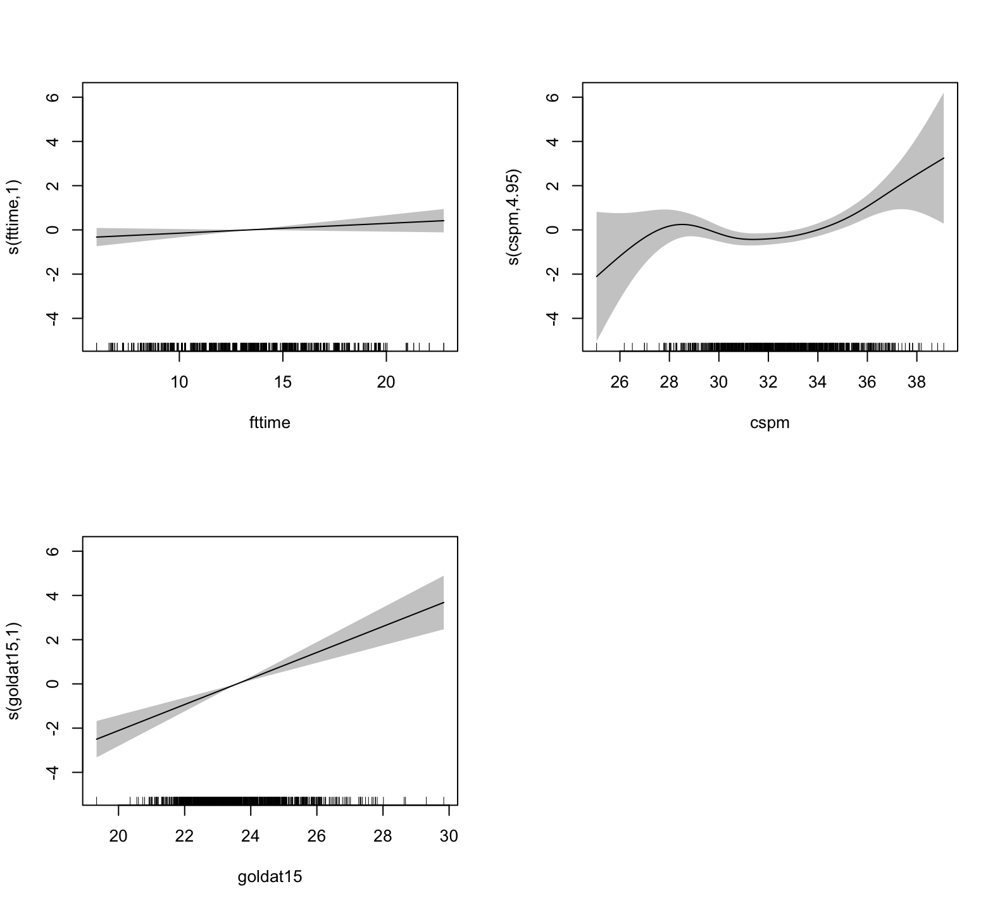

LOL-tournaments-analysis
===========================
To investigate the information, this report was about to show the modeling and analysis on game data in R. In details, it interpreted the relationship between result (win or lose) and some explanatory variables regarding the performance of a team within each match as well as the influence of these explanatory variables.

## 目录

* [0. 数据描述](#0)
* [1. Logistic Regression Model](#1)
* [2. Generalized Linear Mixed Model](#2)
* [3. Generalized Additive Model](#3)

<a id="0"></a>
## 0. 数据描述

原始数据来自[Kaggle](https://www.kaggle.com/kamalchouhbi/league-of-legends-match-data-2017#2017clean.csv)，包含2017年英雄联盟所有赛区的职业联赛数据。作为刚开始的尝试，这篇报告主要提取的是韩国赛区（LCK）春季赛和夏季赛的数据，最后提取完的变量信息如下所示，

|Variable Name|Type|Description|
|----|----|----|
|split|Binary|The split that a game belongs to (spring or summer).|
|game|Multi-class|The round in which two teams fight against each other (1,2 or 3). The rule is Best of 3 Games.|
|side|Binary|The side of the game (red or blue). The situations for teams in opposite sides are not perfectly equal in fact, though Riot tries to balance them.|
|team|Multi-class|The team name.|
|fb|Binary|Whether a team gets the first kill (First Blood) or not (1 - yes, 0 - no). It must happens to either of two team of the game.|
|fbtime|Float|The time (in minute) that First Blood happens.|
|fd|Binary|hether a team slays the first dragon or not (1 - yes, 0 - no). It must happens to either of two team of the game.|
|fdtime|Float|The time (in minute) that First Dragon happens.|
|ft|Binary|Whether a team destroys the first turret or not (1 - yes, 0 - no). It must happens to either of two team of the game.|
|fttime|Float|The time (in minute) that First Turret happens.|
|cspm|Float|Creeps killed (farming) by team per minute.|
|goldat10|Float|Gold (in thousand) owned by a team at 10 minutes of the game.|
|Goldat15|Float|Gold (in thousand) owned by a team at 15 minutes of the game.|
|result|Binary|The response variable. Whether a team wins the game or not (1- yes, 0 - no).|

```r
# Data description
str(DataForWR)
```
```
'data.frame':	880 obs. of  14 variables:
 $ split   : Factor w/ 2 levels "spring","summer": 2 2 2 2 2 2 2 2 2 2 ...
 $ game    : int  1 1 2 2 3 3 1 1 2 2 ...
 $ side    : Factor w/ 2 levels "Blue","Red": 1 2 1 2 1 2 1 2 1 2 ...
 $ team    : Factor w/ 11 levels "Afreeca Freecs",..: 8 4 4 8 8 4 7 6 6 7 ...
 $ fb      : int  1 0 1 0 0 1 1 0 0 1 ...
 $ fbtime  : num  7.58 7.58 4.88 4.88 5.32 ...
 $ fd      : int  1 0 0 1 1 0 1 0 0 1 ...
 $ fdtime  : num  11.17 11.17 13.75 13.75 6.09 ...
 $ ft      : int  0 1 0 1 0 1 0 1 0 1 ...
 $ fttime  : num  15.1 15.1 12.4 12.4 19.1 ...
 $ cspm    : num  32.7 31 30 30.9 29.6 ...
 $ goldat10: num  15.5 14.8 15.1 15 14.1 ...
 $ goldat15: num  23.4 22.4 24.2 24.4 21.9 ...
 $ result  : int  0 1 0 1 1 0 1 0 0 1 ...
```

```r
summary(DataForWR)
```
```
split          game         side                      team           fb          fbtime              fd     
spring:442  Min.   :1.000   Blue:440   Afreeca Freecs     : 93   Min.   :0.0   Min.   : 0.6478   Min.   :0.0  
summer:438  1st Qu.:1.000   Red :440   KT Rolster         : 91   1st Qu.:0.0   1st Qu.: 3.5658   1st Qu.:0.0  
            Median :2.000              ROX Tigers         : 91   Median :0.5   Median : 5.4402   Median :0.5  
            Mean   :1.773              BBQ Olivers        : 89   Mean   :0.5   Mean   : 6.2608   Mean   :0.5  
            3rd Qu.:2.000              Longzhu Gaming     : 89   3rd Qu.:1.0   3rd Qu.: 8.5114   3rd Qu.:1.0  
            Max.   :3.000              Jin Air Green Wings: 86   Max.   :1.0   Max.   :29.2994   Max.   :1.0  
                                         (Other)            :341                                                

     fdtime             ft          fttime            cspm          goldat10        goldat15         result   
 Min.   : 6.089   Min.   :0.0   Min.   : 6.002   Min.   :25.06   Min.   :12.98   Min.   :19.34   Min.   :0.0  
 1st Qu.:10.289   1st Qu.:0.0   1st Qu.:10.975   1st Qu.:30.98   1st Qu.:14.51   1st Qu.:22.53   1st Qu.:0.0  
 Median :12.184   Median :0.5   Median :13.227   Median :32.56   Median :14.94   Median :23.42   Median :0.5  
 Mean   :12.690   Mean   :0.5   Mean   :13.356   Mean   :32.58   Mean   :15.06   Mean   :23.58   Mean   :0.5  
 3rd Qu.:14.684   3rd Qu.:1.0   3rd Qu.:15.633   3rd Qu.:34.09   3rd Qu.:15.46   3rd Qu.:24.46   3rd Qu.:1.0  
 Max.   :25.267   Max.   :1.0   Max.   :22.771   Max.   :39.09   Max.   :19.72   Max.   :29.84   Max.   :1.0  
```

```r
# pairs plot
# Customize upper panel
lowerPanel = function(x, y){
  points(x,y, pch = 20, cex = 0.1, col = c("red", "blue")[as.factor(DataForWR$result)])
}

# Customize diagonal panel
panelHist = function(x) { 
  usr = par("usr"); on.exit(par(usr)) 
  par(usr = c(usr[1:2], 0, 1.5)) 
  h = hist(x, plot = FALSE) 
  breaks = h$breaks; nB = length(breaks) 
  y = h$counts; y = y/max(y) 
  rect(breaks[-nB], 0, breaks[-1], y, col = '#FF9999') 
} 

# Create the plots
pairs(DataForWR[,-14],
      diag.panel = panelHist,
      lower.panel = lowerPanel,
      upper.panel = NULL
      )

par(xpd=TRUE)
legend('topright', col = c("red", "blue"), pch = 20, legend = c("lose", "win"))
```


<a id="1"></a>
## 1. Logistic Regression Model

首先建立全模型（单一项），可以看到有很多变量是不显著的。
```r
lr.full = glm2(result~., family = binomial(link = 'logit'), data = DataForWR)
summary(lr.full)
```
```
Call:
glm2(formula = result ~ ., family = binomial(link = "logit"), 
    data = DataForWR)

Deviance Residuals: 
    Min       1Q   Median       3Q      Max  
-2.4988  -0.7380  -0.0029   0.7437   2.3066  

Coefficients:
                          Estimate Std. Error z value Pr(>|z|)    
(Intercept)             -20.673615   2.934857  -7.044 1.87e-12 ***
splitsummer              -0.086805   0.182979  -0.474 0.635217    
game1                    -0.218410   0.247042  -0.884 0.376643    
game2                    -0.124849   0.245264  -0.509 0.610724    
sideRed                  -0.420095   0.174559  -2.407 0.016102 *  
teamAfreeca Freecs        1.240220   0.485729   2.553 0.010670 *  
teamBBQ Olivers           0.380635   0.494420   0.770 0.441382    
teamEver8 Winners         0.483776   0.626641   0.772 0.440106    
teamJin Air Green Wings   0.489913   0.491067   0.998 0.318449    
teamKT Rolster            1.126934   0.493021   2.286 0.022267 *  
teamLongzhu Gaming        1.169825   0.485108   2.411 0.015888 *  
teamMVP                   0.729449   0.492404   1.481 0.138499    
teamROX Tigers            1.024490   0.488012   2.099 0.035789 *  
teamSamsung Galaxy        1.536791   0.499183   3.079 0.002080 ** 
teamSK Telecom T1         1.983469   0.513229   3.865 0.000111 ***
fb1                       0.348804   0.189005   1.845 0.064968 .  
fbtime                    0.027849   0.025174   1.106 0.268617    
fd1                       0.851386   0.176364   4.827 1.38e-06 ***
fdtime                   -0.001527   0.027681  -0.055 0.956004    
ft1                       0.958703   0.200226   4.788 1.68e-06 ***
fttime                    0.040194   0.029469   1.364 0.172590    
cspm                      0.149679   0.043955   3.405 0.000661 ***
goldat10                 -0.105385   0.179320  -0.588 0.556741    
goldat15                  0.637926   0.115299   5.533 3.15e-08 ***
---
Signif. codes:  0 ‘***’ 0.001 ‘**’ 0.01 ‘*’ 0.05 ‘.’ 0.1 ‘ ’ 1

(Dispersion parameter for binomial family taken to be 1)

    Null deviance: 1219.94  on 879  degrees of freedom
Residual deviance:  841.02  on 856  degrees of freedom
AIC: 889.02

Number of Fisher Scoring iterations: 5
```

剔除这些不显著变量可以使模型拟合得更好，其中一种剔除的方法是借用LR test，检验reduced model和full model是否有显著差别。另一种是直接计算所有可能的模型的拟合优度，通过比较该拟合优度来选择最佳模型，这里我们使用AIC作为标准。

```r
# refine the model
# find the best model by AIC 
fitall = glmulti(result~., family = binomial(link = 'logit'), data = DataForWR, level = 1, method = 'h', crit = 'aicc')
weightable(fitall) 
```
```
                                                                                                      model     aicc     weights
1                                        result ~ 1 + side + team + fb + fd + ft + fttime + cspm + goldat15 880.6440 0.064402554
2                                                 result ~ 1 + side + team + fb + fd + ft + cspm + goldat15 881.2494 0.047582712
3                               result ~ 1 + side + team + fb + fd + ft + fbtime + fttime + cspm + goldat15 881.3071 0.046228886
4                                        result ~ 1 + side + team + fb + fd + ft + fbtime + cspm + goldat15 881.4258 0.043565446
5                             result ~ 1 + side + team + fb + fd + ft + fttime + cspm + goldat10 + goldat15 881.9959 0.032759076
6                                             result ~ 1 + side + team + fd + ft + fttime + cspm + goldat15 882.0701 0.031566935
7                                      result ~ 1 + side + team + fb + fd + ft + cspm + goldat10 + goldat15 882.3137 0.027946050
8                                    result ~ 1 + side + team + fd + ft + fbtime + fttime + cspm + goldat15 882.3904 0.026894541
9                                result ~ 1 + split + side + team + fb + fd + ft + fttime + cspm + goldat15 882.5664 0.024629455
10                              result ~ 1 + side + team + fb + fd + ft + fdtime + fttime + cspm + goldat15 882.7293 0.022702563
...
```

```r
lr.reduce = glm2(result ~ side + team + fb + fd + ft + fttime + cspm + goldat15, family = binomial, data = DataForWR)
summary(lr.reduce)
```
```
Call:
glm2(formula = result ~ side + team + fb + fd + ft + fttime + 
    cspm + goldat15, family = binomial, data = DataForWR)

Deviance Residuals: 
     Min        1Q    Median        3Q       Max  
-2.37472  -0.74750  -0.00909   0.75137   2.39136  

Coefficients:
                         Estimate Std. Error z value Pr(>|z|)    
(Intercept)             -20.78053    2.60552  -7.976 1.52e-15 ***
sideRed                  -0.42593    0.17417  -2.445 0.014467 *  
teamAfreeca Freecs        1.22904    0.47303   2.598 0.009370 ** 
teamBBQ Olivers           0.37742    0.48439   0.779 0.435889    
teamEver8 Winners         0.37437    0.60150   0.622 0.533681    
teamJin Air Green Wings   0.47405    0.48107   0.985 0.324423    
teamKT Rolster            1.09488    0.48263   2.269 0.023294 *  
teamLongzhu Gaming        1.12663    0.47546   2.370 0.017809 *  
teamMVP                   0.69611    0.48052   1.449 0.147430    
teamROX Tigers            1.00280    0.47585   2.107 0.035083 *  
teamSamsung Galaxy        1.49291    0.48844   3.057 0.002239 ** 
teamSK Telecom T1         1.93896    0.50056   3.874 0.000107 ***
fb1                       0.34210    0.18207   1.879 0.060252 .  
fd1                       0.84904    0.17547   4.839 1.31e-06 ***
ft1                       0.97609    0.19851   4.917 8.79e-07 ***
fttime                    0.04500    0.02750   1.636 0.101828    
cspm                      0.14311    0.04262   3.358 0.000784 ***
goldat15                  0.58133    0.09553   6.086 1.16e-09 ***
---
Signif. codes:  0 ‘***’ 0.001 ‘**’ 0.01 ‘*’ 0.05 ‘.’ 0.1 ‘ ’ 1

(Dispersion parameter for binomial family taken to be 1)

    Null deviance: 1219.94  on 879  degrees of freedom
Residual deviance:  843.85  on 862  degrees of freedom
AIC: 879.85

Number of Fisher Scoring iterations: 5
```

可以看待削减完的模型相较全模型有更好的拟合表现。通过削减完的模型，我们可以看出选边、队伍、一血、一龙、一塔、分均补刀、15分钟经济是对游戏结果影响比较显著的变量，其中后五个对游戏胜利起正面作用。通过变量的系数我们可以进一步比较它们的影响。例如选边，选择红色方的胜率会比蓝色方的胜率低（`exp(-0.42593) = 0.6531621`， 说明在忽略其它影响因素的情况下，红色边会比蓝色边在胜败比上少35%）；战队方面，SKT是所有队伍中胜率最高的，其次有Samsung Galaxy、Afreeca Freecs等，而垫底的是Kongdoo Monster。同时我们可以比较两个战队，例如SKT和Samsung Galaxy，SKT的胜率会更高（`exp(1.93896-1.49291) = 1.56213`，说明如果忽略其它影响，SKT会比Samsung Galaxy在胜败比上有56%的提升）。

此外，我们可以通过交叉项来验证多重关系。比如，我们已经知道蓝色方胜率更高，那么不同队伍的选边是不是还有差别（有些队伍擅长蓝色方有些擅长红色方），因此我们可以加入交叉项`side:team`。

```r
lr.inter = glm2(result ~ side + team + fb + fd + ft + fttime + cspm + goldat15 + side:team, family = binomial, data = DataForWR)
summary(lr.inter)
```
```
Call:
glm2(formula = result ~ side + team + fb + fd + ft + fttime + 
    cspm + goldat15 + side:team, family = binomial, data = DataForWR)

Deviance Residuals: 
     Min        1Q    Median        3Q       Max  
-2.35461  -0.74963  -0.01776   0.74367   2.40442  

Coefficients:
                                 Estimate Std. Error z value Pr(>|z|)    
(Intercept)                     -20.54916    2.63988  -7.784 7.02e-15 ***
sideRed                          -1.27816    0.80578  -1.586  0.11268    
teamAfreeca Freecs                0.91966    0.68286   1.347  0.17805    
teamBBQ Olivers                   0.06648    0.69539   0.096  0.92384    
teamEver8 Winners                -0.05191    0.80901  -0.064  0.94883    
teamJin Air Green Wings           0.18521    0.68245   0.271  0.78609    
teamKT Rolster                    0.56684    0.70181   0.808  0.41927    
teamLongzhu Gaming                0.63115    0.68307   0.924  0.35549    
teamMVP                           0.20971    0.68212   0.307  0.75851    
teamROX Tigers                    0.55733    0.66891   0.833  0.40474    
teamSamsung Galaxy                0.75661    0.70435   1.074  0.28274    
teamSK Telecom T1                 1.13607    0.70554   1.610  0.10735    
fb1                               0.35377    0.18401   1.923  0.05453 .  
fd1                               0.85118    0.17813   4.778 1.77e-06 ***
ft1                               0.96890    0.19987   4.848 1.25e-06 ***
fttime                            0.04612    0.02782   1.658  0.09736 .  
cspm                              0.14114    0.04320   3.267  0.00109 ** 
goldat15                          0.59272    0.09667   6.132 8.70e-10 ***
sideRed:teamAfreeca Freecs        0.57316    0.96370   0.595  0.55201    
sideRed:teamBBQ Olivers           0.57152    0.97883   0.584  0.55930    
sideRed:teamEver8 Winners         0.78512    1.22340   0.642  0.52103    
sideRed:teamJin Air Green Wings   0.48957    0.97289   0.503  0.61482    
sideRed:teamKT Rolster            0.97745    0.97155   1.006  0.31438    
sideRed:teamLongzhu Gaming        0.93213    0.96001   0.971  0.33157    
sideRed:teamMVP                   0.91533    0.96763   0.946  0.34418    
sideRed:teamROX Tigers            0.83786    0.95503   0.877  0.38032    
sideRed:teamSamsung Galaxy        1.36384    0.97813   1.394  0.16322    
sideRed:teamSK Telecom T1         1.54090    0.98856   1.559  0.11906    
---
Signif. codes:  0 ‘***’ 0.001 ‘**’ 0.01 ‘*’ 0.05 ‘.’ 0.1 ‘ ’ 1

(Dispersion parameter for binomial family taken to be 1)

    Null deviance: 1219.94  on 879  degrees of freedom
Residual deviance:  839.32  on 852  degrees of freedom
AIC: 895.32

Number of Fisher Scoring iterations: 5
```

从结果可以看出，加上交叉项的模型拟合得更差了，而且交叉项也并不显著，所以说明没有队伍是明显擅长红色方或蓝色方。

<a id="2"></a>
## 2. Generalized Linear Mixed Model

如果想查看各队伍在某些变量上的表现，可以借助GLMM。从下图可以看出，各个战队的“15分钟经济”对游戏结果的影响是有差别的，具体体现在截距和斜率上，截距体现的是每个队伍的baseline水平，而斜率则体现出该变量每单位的变化对结果的影响。

```r
xyplot(result~goldat15|team, 
       panel = function(x, y) {
         panel.xyplot(x, y)
         panel.lmline(x, y)
       },
       data = DataForWR)
```


```r
# random intercepts
glm1.1 = glmer(result~goldat15+(1|team), family = binomial, data = DataForWR)
# random slopes 
glm1.2 = glmer(result~goldat15 +(0+goldat15|team), family = binomial, data = DataForWR)
# independent random intercepts and slopes
glm1.3 = glmer(result~goldat15 +(goldat15|team), family = binomial, data = DataForWR)
# dependent random intercepts and slopes
glm1.4 = glmer(result~goldat15 +(goldat15||team), family = binomial, data = DataForWR)
```

建完对应的模型后我们进行比较，

```r
summary(glm1.1)
```
```
Generalized linear mixed model fit by maximum likelihood (Laplace Approximation) ['glmerMod']
 Family: binomial  ( logit )
Formula: result ~ goldat15 + (1 | team)
   Data: DataForWR

     AIC      BIC   logLik deviance df.resid 
   970.8    985.2   -482.4    964.8      877 

Scaled residuals: 
    Min      1Q  Median      3Q     Max 
-3.7410 -0.6711 -0.0342  0.7242  2.9808 

Random effects:
 Groups Name        Variance Std.Dev.
 team   (Intercept) 0.2492   0.4992  
Number of obs: 880, groups:  team, 11

Fixed effects:
             Estimate Std. Error z value Pr(>|z|)    
(Intercept) -21.57918    1.76655  -12.21   <2e-16 ***
goldat15      0.91550    0.07496   12.21   <2e-16 ***
---
Signif. codes:  0 ‘***’ 0.001 ‘**’ 0.01 ‘*’ 0.05 ‘.’ 0.1 ‘ ’ 1

Correlation of Fixed Effects:
         (Intr)
goldat15 -0.995
```

```r
summary(glm1.2)
```
```
Generalized linear mixed model fit by maximum likelihood (Laplace Approximation) ['glmerMod']
 Family: binomial  ( logit )
Formula: result ~ goldat15 + (0 + goldat15 | team)
   Data: DataForWR

     AIC      BIC   logLik deviance df.resid 
   971.1    985.5   -482.6    965.1      877 

Scaled residuals: 
    Min      1Q  Median      3Q     Max 
-3.6955 -0.6747 -0.0386  0.7255  2.9551 

Random effects:
 Groups Name     Variance  Std.Dev.
 team   goldat15 0.0004521 0.02126 
Number of obs: 880, groups:  team, 11

Fixed effects:
            Estimate Std. Error z value Pr(>|z|)    
(Intercept) -21.5604     1.7611  -12.24   <2e-16 ***
goldat15      0.9147     0.0753   12.15   <2e-16 ***
---
Signif. codes:  0 ‘***’ 0.001 ‘**’ 0.01 ‘*’ 0.05 ‘.’ 0.1 ‘ ’ 1

Correlation of Fixed Effects:
         (Intr)
goldat15 -0.995
```

```r
summary(glm1.3)
```
```
Generalized linear mixed model fit by maximum likelihood (Laplace Approximation) ['glmerMod']
 Family: binomial  ( logit )
Formula: result ~ goldat15 + (goldat15 | team)
   Data: DataForWR

     AIC      BIC   logLik deviance df.resid 
   974.5    998.4   -482.3    964.5      875 

Scaled residuals: 
    Min      1Q  Median      3Q     Max 
-4.0596 -0.6768 -0.0280  0.7249  3.0475 

Random effects:
 Groups Name        Variance Std.Dev. Corr 
 team   (Intercept) 3.4369   1.85388       
        goldat15    0.0037   0.06083  -0.99
Number of obs: 880, groups:  team, 11

Fixed effects:
            Estimate Std. Error z value Pr(>|z|)    
(Intercept) -21.6586     1.8684  -11.59   <2e-16 ***
goldat15      0.9188     0.0781   11.77   <2e-16 ***
---
Signif. codes:  0 ‘***’ 0.001 ‘**’ 0.01 ‘*’ 0.05 ‘.’ 0.1 ‘ ’ 1

Correlation of Fixed Effects:
         (Intr)
goldat15 -0.996
```

```r
summary(glm1.4)
```
```
Generalized linear mixed model fit by maximum likelihood (Laplace Approximation) ['glmerMod']
 Family: binomial  ( logit )
Formula: result ~ goldat15 + (goldat15 || team)
   Data: DataForWR

     AIC      BIC   logLik deviance df.resid 
   972.8    992.0   -482.4    964.8      876 

Scaled residuals: 
    Min      1Q  Median      3Q     Max 
-3.7410 -0.6711 -0.0342  0.7242  2.9809 

Random effects:
 Groups Name        Variance Std.Dev.
 team   (Intercept) 0.2492   0.4992  
 team.1 goldat15    0.0000   0.0000  
Number of obs: 880, groups:  team, 11

Fixed effects:
             Estimate Std. Error z value Pr(>|z|)    
(Intercept) -21.57919    1.76615  -12.22   <2e-16 ***
goldat15      0.91550    0.07494   12.22   <2e-16 ***
---
Signif. codes:  0 ‘***’ 0.001 ‘**’ 0.01 ‘*’ 0.05 ‘.’ 0.1 ‘ ’ 1

Correlation of Fixed Effects:
         (Intr)
goldat15 -0.995
convergence code: 0
boundary (singular) fit: see ?isSingular
```

```r
lrtest(glm1.1, glm1.3)
```
```
Likelihood ratio test

Model 1: result ~ goldat15 + (1 | team)
Model 2: result ~ goldat15 + (goldat15 | team)
  #Df  LogLik Df  Chisq Pr(>Chisq)
1   3 -482.42                     
2   5 -482.27  2 0.2955     0.8627
```

综上，首先第四个模型就被排除了，因为出现了过拟合的现象。而前三个模型的差别不大，所以选择更简单的模型，即第一个模型。这说明每个战队在“15分钟经济”上的baseline有所差异，而该变量对结果的影响在战队间并无明显差距，以整体的水平即可概括。以下展示更具体的信息，

```r
coef(glm1.1)
```
```
$team
                    (Intercept)  goldat15
Kongdoo Monster       -22.10311 0.9155033
Afreeca Freecs        -21.20499 0.9155033
BBQ Olivers           -22.05613 0.9155033
Ever8 Winners         -21.99291 0.9155033
Jin Air Green Wings   -22.01495 0.9155033
KT Rolster            -21.42272 0.9155033
Longzhu Gaming        -21.27439 0.9155033
MVP                   -21.72670 0.9155033
ROX Tigers            -21.72858 0.9155033
Samsung Galaxy        -21.04499 0.9155033
SK Telecom T1         -20.78550 0.9155033

attr(,"class")
[1] "coef.mer"
```

每个战队在“15分钟经济”的baseline有所差别，其中SKT的截距系数最大，说明其15分钟通常拥有所有战队里最高的经济，而Kongdoo Monster的最小，说明其在15分钟的经济低于其它队伍。而斜率方面所有队伍保持一致，说明该变量对结果的影响不存在个体间的明显差异。

<a id="3"></a>
## 3. Generalized Additive Model

在前面的模型中，我们考虑的是连续变量对结果程线性相关的情况，但实际情况有时并非如此。所以这里使用GAM，把所有的连续项在建模时以spline平滑处理。

```r
gam1 = gam(result~side + team + fb + fd + ft + s(fttime) + s(cspm) + s(goldat15), family = binomial, data = DataForWR)
plot(gam1, pages = 1, se = TRUE, shade = TRUE)
summary(gam1)
```
```
Family: binomial 
Link function: logit 

Formula:
result ~ side + team + fb + fd + ft + s(fttime) + s(cspm) + s(goldat15)

Parametric coefficients:
                        Estimate Std. Error z value Pr(>|z|)    
(Intercept)              -1.6936     0.4570  -3.706 0.000211 ***
sideRed                  -0.4225     0.1771  -2.386 0.017016 *  
teamAfreeca Freecs        1.1399     0.4808   2.371 0.017738 *  
teamBBQ Olivers           0.2282     0.4928   0.463 0.643322    
teamEver8 Winners         0.2199     0.6118   0.359 0.719243    
teamJin Air Green Wings   0.4011     0.4898   0.819 0.412773    
teamKT Rolster            1.0340     0.4897   2.111 0.034736 *  
teamLongzhu Gaming        1.0295     0.4839   2.128 0.033365 *  
teamMVP                   0.6030     0.4874   1.237 0.216026    
teamROX Tigers            0.9415     0.4815   1.956 0.050521 .  
teamSamsung Galaxy        1.3479     0.4955   2.720 0.006527 ** 
teamSK Telecom T1         1.7361     0.5093   3.409 0.000652 ***
fb1                       0.3624     0.1848   1.961 0.049853 *  
fd1                       0.8793     0.1780   4.939 7.85e-07 ***
ft1                       0.9843     0.2017   4.880 1.06e-06 ***
---
Signif. codes:  0 ‘***’ 0.001 ‘**’ 0.01 ‘*’ 0.05 ‘.’ 0.1 ‘ ’ 1

Approximate significance of smooth terms:
             edf Ref.df Chi.sq  p-value    
s(fttime)   1.00  1.000   2.49    0.115    
s(cspm)     4.95  6.135  28.37 8.56e-05 ***
s(goldat15) 1.00  1.000  36.81 1.30e-09 ***
---
Signif. codes:  0 ‘***’ 0.001 ‘**’ 0.01 ‘*’ 0.05 ‘.’ 0.1 ‘ ’ 1

R-sq.(adj) =  0.373   Deviance explained = 32.9%
UBRE = -0.01978  Scale est. = 1         n = 880
```




可以看出`cspm`项明显对游戏结果呈现非线性关系，而`goldat15`则呈现线性关系，可以取消平滑，`fttime`项不显著，可以剔除。重新建模后进行比较，

```r
gam2 = gam(result~side + team + fb + fd + ft + s(cspm) + goldat15, family = binomial, data = DataForWR)
anova(gam1, gam2, test = "Chisq")
```
```
Analysis of Deviance Table

Model 1: result ~ side + team + fb + fd + ft + s(fttime) + s(cspm) + s(goldat15)
Model 2: result ~ side + team + fb + fd + ft + s(cspm) + goldat15
  Resid. Df Resid. Dev    Df Deviance Pr(>Chi)
1    856.86     818.69                        
2    857.94     821.40 -1.08  -2.7052    0.111
```
```r
AIC(gam2)
```
```
[1] 863.1574
```

可以看出重建后的模型和之前的模型无显著差异，但比前者简单，所以更加被倾向，863.1574的AIC说明比前面的Logistic Regression Model拟合得更好。